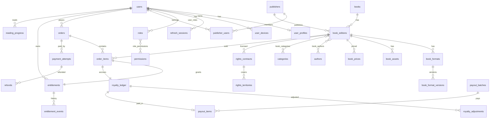

# ERD (vista por domínio) — fonte de verdade: `database/migrations/*.sql`

```mermaid
erDiagram
  users ||--o| user_profiles : has
  users ||--o{ user_devices : owns
  users ||--o{ refresh_sessions : has
  users }o--o{ roles : user_roles
  roles }o--o{ permissions : role_permissions
  publishers ||--o{ publisher_users : members
  users ||--o{ publisher_users : belongs
  books ||--o{ book_editions : has
  publishers ||--o{ book_editions : publishes
  book_editions ||--o{ book_formats : has
  book_formats ||--o{ book_format_versions : versions
  book_editions ||--o{ book_assets : has
  book_editions ||--o{ book_prices : priced
  book_editions }o--o{ authors : book_authors
  book_editions }o--o{ categories : book_categories
  rights_contracts ||--o{ rights_territories : covers
  book_editions ||--o{ rights_contracts : licensed
  users ||--o{ orders : places
  orders ||--o{ order_items : contains
  book_editions ||--o{ order_items : sold
  orders ||--o{ payment_attempts : paid_by
  payment_attempts ||--o{ refunds : refunded
  order_items ||--|| entitlements : grants
  users ||--o{ entitlements : owns
  entitlements ||--o{ entitlement_events : history
  users ||--o{ reading_progress : reads
  order_items ||--|| royalty_ledger : accrues
  royalty_ledger ||--o{ royalty_adjustments : adjusted
  payout_batches ||--o{ payout_items : pays
  royalty_ledger ||--o| payout_items : paid_in
```
